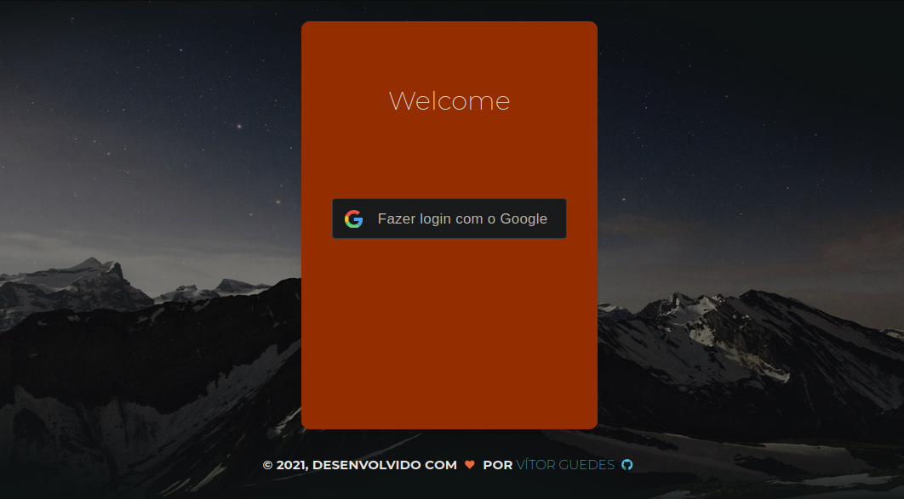

# [Consumo de API - Login com com Google](http://demos.creative-tim.com/paper-kit-2) 




## **Login com Google** 
    Utilização da API do Google Developer Console.

A página utilizada no projeto foi estraida do **TEMPLATE** **[Paper Kit 2](https://demos.creative-tim.com/paper-kit-2/index.html)** a qual contém um **kIT DE UI** desenvolvida em Bootstrap, gratuito e com cores claras, bela tipografia e desenhos elaborados e com alguns ajustes de tamanhos.

## Conteúdo

- [Consumo de API - Login com com Google](#consumo-de-api---login-com-com-google)
  - [**Login com Google**](#login-com-google)
  - [Conteúdo](#conteúdo)
  - [Getting Started](#getting-started)
  - [**Testar o Projeto:**](#testar-o-projeto)
    - [Configure seu painel no Google Developer Console](#configure-seu-painel-no-google-developer-console)
  - [Estrutura de Arquivos](#estrutura-de-arquivos)
  - [:construction:  Ferramentas e Tecnologias Utilizadas no Projeto](#construction--ferramentas-e-tecnologias-utilizadas-no-projeto)
  - [Visão de Melhorias do Projeto](#visão-de-melhorias-do-projeto)
  - [Licença](#licença)

## Getting Started

  O Projeto `Login com Google` foi desenvolvido para com o objetivo de consumir dados públicos da **API do Google**, através de uma página simples que simula o processo de Login em um site/sistema. 

  O retorno esperado, é o preenchimento automático dos seguintes dados públicos 

  *  `Nome` (UserName)
  *  `Foto de Perfil` (pricture)

## **Testar o Projeto:**

  ### Configure seu painel no Google Developer Console

  - Baixe os arquivos deste repositório
  - Entre no [developers console](https://console.cloud.google.com/apis/dashboard)
  - Crie o seu projeto
  - Clique em credenciais e depois em configurar tela de consentimento
  - Preencha as informações na tela de consentimento, não precisa adicionar nada em URL autorizadas
  - Volte em credenciais, crie uma nova credencial
  - Coloque nos email de teste, o email que você quer usar para testar seu app de login
 Coloque em URLs autorizadas a URL: http://localhost:5500 e http://localhost
  - Salve e copie seu Cliente ID para o arquivo `googlelogin.js`
  - Execute o projeto no seu navegador  
  
  ```
  Observe o preenchimento atumático das informações da conta de email utilizada para logar.
  ```


## Estrutura de Arquivos

No projeto, você encontrará os seguintes diretórios e arquivos:
```
logingoogle:

├── assets
│   ├── css
│   │   ├── bootstrap.min.css
│   │   ├── bootstrap.min.css.map
│   │   └── paper-kit.css
│   ├── img
│   │   └── favicon.ico
│   │   └── favicon.png
│   │   └── login-image.jpg
│   ├── js
│   │   ├── googlelogin.js
├── .gitignore
├── index.html
├── README.md

```
## :construction:  Ferramentas e Tecnologias Utilizadas no Projeto
  *  
  *   
  *   
  *   
  *   
  *   
  *   
  *   
  *   

## Visão de Melhorias do Projeto

  - Página de `Profile`
  - Redirecionamento após o login para a página de `profile`, com mais dados sobre o perfil utilizada no login.


## Licença 

  

  Copyright :copyright: 2021 - CardLinks